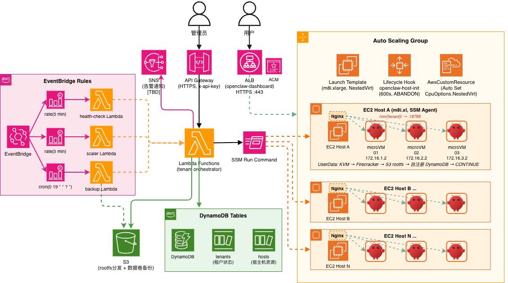
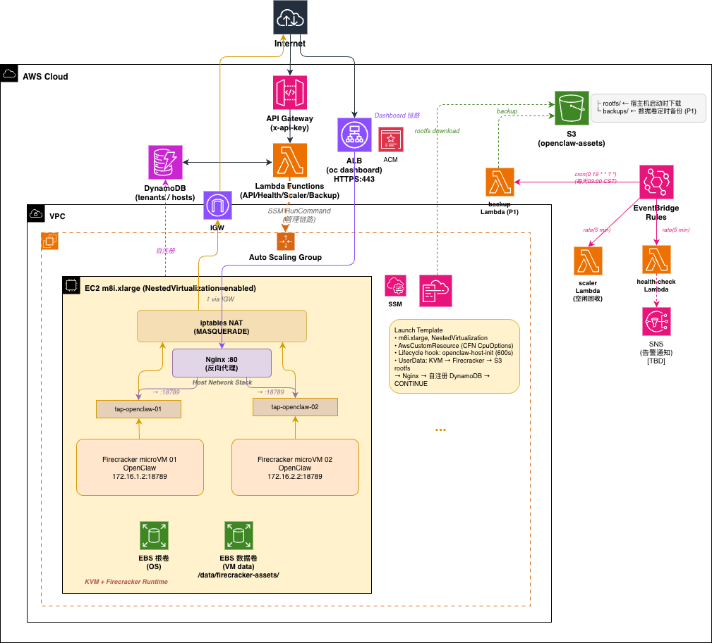
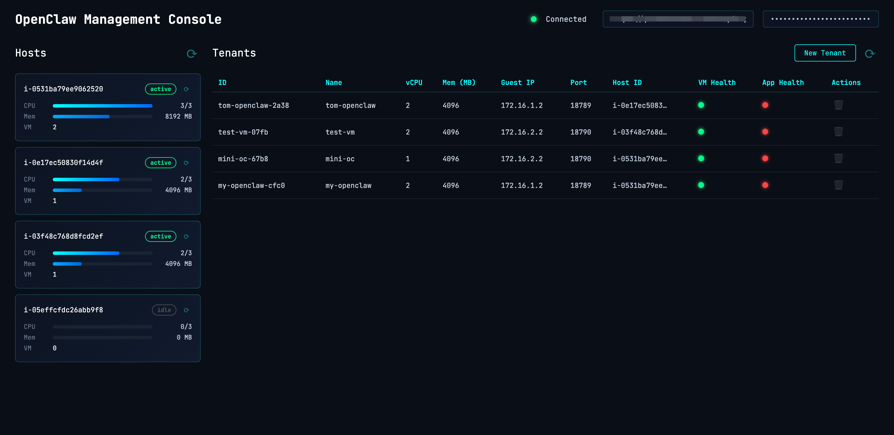

# OpenClaw Pool on EC2 microVM


**[English](README.md)** | **[中文](docs/README-CN.md)** | **[Changelog](docs/CHANGELOG.md)**

Multi-tenant isolated deployment of OpenClaw AI agents on AWS using Firecracker microVMs. Each tenant runs in its own microVM with independent kernel, filesystem, and network. Managed via API, with auto-scaling hosts and idle reclamation.

> This project uses EC2 [nested virtualization](https://docs.aws.amazon.com/AWSEC2/latest/UserGuide/nested-virtualization.html) to run KVM + Firecracker inside EC2 instances. Currently supports Intel instance families (c8i/m8i/r8i, etc.).

## Features

- **Tenant Management** — Create/delete/query tenants via API. Each tenant is an OpenClaw instance running in an isolated Firecracker microVM with its own rootfs, data volume, and network
- **Security Isolation** — Firecracker microVM-based isolation: independent kernel, network, and filesystem per tenant
- **Auto Scheduling** — Automatically selects a host with available resources; scales out when capacity is insufficient
- **Auto Scale-in** — Idle hosts are reclaimed after timeout (two-round confirmation to prevent false kills)
- **Health Checks** — All VMs probed every minute; auto-restart on consecutive failures. Creating VMs get a 10-minute grace period with no SSM commands
- **Web Console** — Visual management of hosts and tenants with real-time status
- **Rootfs Pre-build** — Rootfs + data template distributed via S3, downloaded on host init
- **Dashboard Access** — Each tenant's OpenClaw Dashboard accessible at `/vm/{tenant-id}/` via ALB path-based routing + Nginx, supports WebSocket, auto-routes across multiple hosts
- **Auto Backup** — EventBridge scheduled backup of all tenant data volumes to S3, with manual trigger and backup query API
- **AgentCore Integration** — Optional toggle; when enabled, all VMs auto-connect to AgentCore Gateway (MCP tool hub), Memory, Code Interpreter, and Browser
- **Shared Skills** — All tenants share a unified skill set (S3-managed, auto-synced to all VMs), with independent memory
- **Default Toolchain** — Each VM comes with Python3/uv/git/gh/Node.js/htop/tmux/tree pre-installed
- **Data Backup** — Automated daily backup + manual backup API, Firecracker pause/resume for consistency

## Architecture

```
Admin / User
    │
    ├── API Gateway (HTTPS, x-api-key) ──→ Lambda ──→ DynamoDB
    │                                                  ├── tenants
    │                                                  └── hosts
    │
    └── ALB (HTTPS) ──→ Host Nginx:80 ──→ VM Gateway:18789
                        ├── /vm/{tenant-a}/ → 172.16.1.2
                        └── /vm/{tenant-b}/ → 172.16.2.2

Lambda ── SSM Run Command ──→ EC2 Host
                               ├── microVM 01 (172.16.1.2)
                               ├── microVM 02 (172.16.2.2)
                               └── ...

S3: rootfs distribution + data backup + shared skills
ASG: auto-scaling hosts
EventBridge: health checks + idle reclamation + scheduled backup
```

<details>
<summary>System Architecture</summary>



</details>

<details>
<summary>Deployment Architecture</summary>



</details>

## Project Structure

```
openclaw-firecracker/
├── deploy/                    # CDK project
│   ├── stack.py               # Infrastructure definition
│   ├── lambda/
│   │   ├── api/handler.py     # Tenant CRUD + host management
│   │   ├── health_check/handler.py  # Scheduled health checks
│   │   ├── agentcore_tools/handler.py  # AgentCore Gateway Lambda tools
│   │   └── scaler/handler.py  # Idle host reclamation
│   └── userdata/
│       ├── init-host.sh       # Host initialization
│       ├── launch-vm.sh       # microVM launch
│       └── stop-vm.sh         # microVM stop
├── console/                   # Web management console
│   ├── index.html             # Alpine.js SPA
│   ├── style.css
│   └── config.js              # Auto-generated
├── config.yml                 # Global config (single source of truth)
├── setup.sh                   # One-click deploy + export .env.deploy
├── build-rootfs.sh            # Build rootfs + data template, upload to S3
├── web-console.sh             # Start web management console
├── scripts/
│   ├── bind-domain.sh         # Bind custom domain + HTTPS to ALB
│   ├── destroy.sh             # Tear down environment (--purge for full cleanup)
│   ├── oc-connect.sh          # SSH into OpenClaw microVM
│   └── oc-dashboard.sh        # Access OpenClaw dashboard
└── docs/
```

## Prerequisites

- AWS account + CLI configured
- CDK CLI + Python 3.12+
- uv (Python package manager)

## Quick Start

```bash
# 1. Deploy infrastructure
./setup.sh ap-northeast-1 lab
# Environment variables saved to .env.deploy

# 2. Configure OpenClaw app settings (first time)
cat > .env.openclaw << 'EOF'
OPENCLAW_API_KEY=your-bedrock-api-key
OPENCLAW_BASE_URL=https://bedrock-mantle.us-west-2.api.aws/v1
OPENCLAW_MODEL_ID=deepseek.v3.2
OPENCLAW_TOOLS_PROFILE=coding
OPENCLAW_DM_SCOPE=per-peer
EOF

# 3. Build and upload rootfs
./build-rootfs.sh v1.0

# 4. Create a tenant (OpenClaw instance)
source .env.deploy
curl -s -X POST "${API_URL}tenants" -H "x-api-key: ${API_KEY}" \
  -d '{"name":"my-agent","vcpu":2,"mem_mb":4096}' | jq .

# 5. Check tenant status
curl -s "${API_URL}tenants" -H "x-api-key: ${API_KEY}" | jq .

# 6. SSH into microVM
./scripts/oc-connect.sh <tenant-id>

# 7. Delete tenant
curl -s -X DELETE "${API_URL}tenants/<tenant-id>" -H "x-api-key: ${API_KEY}" | jq .
```

## Management Console

Web-based console for visual host/tenant management.

```bash
./web-console.sh    # Reads .env.deploy, starts http://localhost:8080
```



Features:
- Host resource usage (vCPU / memory / VM count)
- Create / delete tenants
- Filter tenants by host
- Real-time health status (vm_health / app_health)
- Quick-copy connect and dashboard commands
- Auto-injected API URL and key

## Dashboard Access

Each tenant's OpenClaw Dashboard is accessible via ALB + Nginx reverse proxy, no SSM tunnel required:

```
https://{your-domain}/vm/{tenant-id}/    → Tenant Dashboard (WebSocket)
```

**Prerequisite: HTTPS Required**

OpenClaw Gateway Dashboard requires a Secure Context (HTTPS) for device pairing:

1. Custom domain + DNS CNAME pointing to ALB
2. ACM certificate (free, DNS validation)

```bash
# After ACM certificate is issued and DNS validated:
./scripts/bind-domain.sh dashboard.example.com arn:aws:acm:ap-northeast-1:xxx:certificate/xxx
```

The script creates/updates the ALB HTTPS listener and writes `DASHBOARD_URL` to `.env.deploy`.

Traffic flow: `Browser → ALB:443 → Host Nginx:80 → VM Gateway:18789`

Nginx config is automatically managed by launch-vm.sh / stop-vm.sh.

## Custom Domain

Bind a custom domain + HTTPS to the Dashboard ALB:

```bash
# Prerequisites:
# 1. Request ACM certificate and complete DNS validation
# 2. CNAME your domain to the ALB DNS (see DASHBOARD_URL in .env.deploy)

./scripts/bind-domain.sh oc.example.com arn:aws:acm:ap-northeast-1:xxx:certificate/xxx

# Access: https://oc.example.com/vm/{tenant-id}/
```

The script creates the ALB HTTPS listener, attaches the ACM certificate, and updates `DASHBOARD_URL` in `.env.deploy`.

## Auto Backup

EventBridge schedules daily backups of all running tenant data volumes to S3. Manual trigger also supported.

**Backup flow**: pause VM → pigz compress data.ext4 → resume VM → upload to S3. VM auto-resumes even on failure (trap cleanup).

```bash
source .env.deploy

# Manual backup (async, returns 202)
curl -s -X POST "${API_URL}tenants/{id}/backup" -H "x-api-key: ${API_KEY}" | jq .

# List backups
curl -s "${API_URL}tenants/{id}/backups" -H "x-api-key: ${API_KEY}" | jq .

# Config (config.yml):
# backup_cron: "cron(0 19 * * ? *)"  # UTC 19:00 = Beijing 03:00
# backup_retention_days: 7            # S3 lifecycle auto-cleanup
```

Backups stored at `s3://{bucket}/backups/{tenant-id}/{timestamp}.gz`.

## Shared Skills

All tenants share a unified skill set (SKILL.md files), with independent memory per tenant.

```bash
# Upload skills to S3 (auto-synced to all VMs)
aws s3 sync ./my-skills/ s3://${ASSETS_BUCKET}/skills/ --profile $PROFILE

# Sync chain:
# S3 → Host /data/shared-skills/ (cron 5min) → All running VMs
# New VMs get skills injected into data volume at launch
```

## Auto Scaling

**Scale-out** — No available host when creating a tenant → tenant enters `pending` → ASG launches new instance → pending tenants auto-assigned after init

**Scale-in** — Scaler Lambda checks every 5 minutes:
1. Host with `vm_count=0` exceeding `idle_timeout_minutes` → marked `idle`
2. Next round confirms still idle and ASG instances > min → terminate
3. If a tenant is assigned during this window → auto-recover to `active`

## Configuration

### Config Files

| File | Purpose |
|------|---------|
| `config.yml` | Infrastructure params (instance type, VM specs, S3 prefix, ASG) |
| `.env.deploy` | Deploy environment (region, API URL/Key, bucket) — auto-generated |
| `.env.openclaw` | OpenClaw app config (model, API key, tools profile) |

### config.yml

| Section | Key | Default | Description |
|---------|-----|---------|-------------|
| host | instance_type | c8i.2xlarge | Must support NestedVirtualization (c8i/m8i/r8i) |
| host | reserved_vcpu | 1 | Reserved for host OS |
| host | reserved_mem_mb | 2048 | Reserved for host OS |
| host | cpu_overcommit_ratio | 1.0 | CPU overcommit ratio (2.0 = allocate 2x vCPU, memory not overcommitted) |
| asg | min_capacity | 1 | Minimum instances |
| asg | max_capacity | 5 | Maximum instances |
| asg | use_spot | false | Spot instances (save ~60-70%, may be reclaimed) |
| vm | default_vcpu | 2 | Default vCPU per tenant |
| vm | default_mem_mb | 4096 | Default memory (MB) |
| vm | data_disk_mb | 4096 | Data volume size (MB) |
| health_check | interval_minutes | 1 | Health check interval |
| health_check | max_failures | 3 | Auto-restart after consecutive failures |
| scaler | interval_minutes | 5 | Idle detection interval |
| scaler | idle_timeout_minutes | 10 | Idle timeout (minutes) |

Redeploy after changes: `./setup.sh <region> <profile>`

### Tear Down

```bash
./scripts/destroy.sh           # Destroy stack, keep S3 bucket and DynamoDB tables
./scripts/destroy.sh --purge   # Full cleanup including S3 data and DynamoDB tables
```

## API Reference

All requests require `x-api-key` header.

| Method | Path | Description |
|--------|------|-------------|
| GET | /tenants | List all tenants |
| POST | /tenants | Create tenant `{"name":"xx","vcpu":2,"mem_mb":4096}` |
| GET | /tenants/{id} | Get tenant details |
| DELETE | /tenants/{id} | Delete tenant (`?keep_data=true` to preserve data volume) |
| POST | /tenants/{id}/restart | Restart VM (reuse disks, fast) |
| POST | /tenants/{id}/stop | Stop VM (disks preserved) |
| POST | /tenants/{id}/start | Start a stopped VM |
| POST | /tenants/{id}/pause | Freeze vCPU (Firecracker native, instant) |
| POST | /tenants/{id}/resume | Resume a paused VM |
| POST | /tenants/{id}/reset | Reinstall rootfs (data volume preserved) |
| POST | /tenants/{id}/backup | Manual data backup (async, returns 202) |
| GET | /tenants/{id}/backups | List backups |
| GET | /hosts | List all hosts |
| POST | /hosts | Register host (called by UserData) |
| POST | /hosts/refresh-rootfs | Push latest rootfs to all hosts |
| GET | /hosts/rootfs-version | Query current rootfs version (manifest.json) |
| DELETE | /hosts/{id} | Deregister host |

## Network Model

Each VM uses an independent /24 subnet, communicating with the host via TAP device:

```
VM1: tap-vm1  host=172.16.1.1/24  guest=172.16.1.2/24
VM2: tap-vm2  host=172.16.2.1/24  guest=172.16.2.2/24
VMn: tap-vmN  host=172.16.N.1/24  guest=172.16.N.2/24
```

- Outbound: iptables MASQUERADE → internet
- Inbound: ALB → Nginx reverse proxy → VM:18789
- Inter-VM: fully isolated, no routing between subnets

## Rootfs Management

The build script produces two images: rootfs (OS + software) and data template (/home/agent pre-configured content).

Versions managed via S3 `manifest.json`. Hosts and tenants track their `rootfs_version`.

```bash
# Build and upload (updates manifest.json + refreshes hosts)
./build-rootfs.sh v1.8

# Manually refresh host images
source .env.deploy
curl -s -X POST "${API_URL}hosts/refresh-rootfs" -H "x-api-key: ${API_KEY}" | jq .

# Query current version
curl -s "${API_URL}hosts/rootfs-version" -H "x-api-key: ${API_KEY}" | jq .

# New VMs use the latest version; existing VMs need reset to update
```
